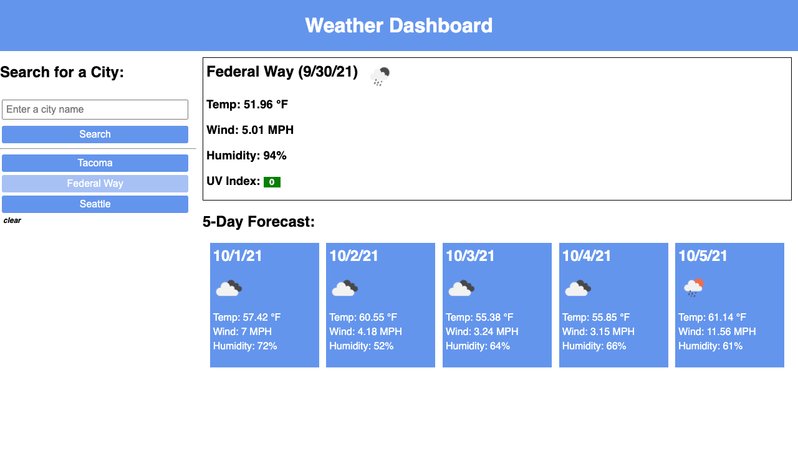

# The Weather Dashboard

## 

I created a weather dashboard that allows the user to search the name of a city and see not only current weather but a five-day forecast. Information shown includes temperature, wind speed, humidity, and UV index. Also, an icon representing the weather condition that can be moused over for a description.

When the user inputs a search, the searched city will be added to a bank on the left. This bank can be selected from to display the corresponding weather information about that city. I included a clear button to clear the saved cities. When the session ends, the saved cities will persist.

---

## Screenshot:

---

## Links:

### [GitHub Repository](https://github.com/Chrisaeus/Weather-Dashboard)

### [Live Website](https://chrisaeus.github.io/Weather-Dashboard/)